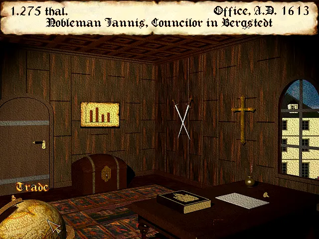

How long have you wanted to play *Die Fugger II* in English? If your answer is
“I have never heard of this game but the name is mildly amusing”, then I've got
great news for you.



This is a translation of *Die Fugger II* into English. The actual translation
was generated by AI, specifically ChatGPT with model `gpt-4o`. Also included in
this repository is all the tools used to make the patch, and some translated
documentation for the game.

This patch applies to the version which the README calls an “überarbeitete”
version, which has the following sha1sum:

```
22c603f21b010dbd8782a7e2cdfd56aea0c0da21  FUGGER2.EXE
```

It may work with other versions, and at least should be relatively easy to adapt
to other versions with some expertise, but has only been tested with this one.

A translation of the handbook is also available, in
[handbook-en.txt](handbuch/handbook-en.txt). It was translated in a similar way.
Thanks to archive.org user Eulisker for uploading the [original German
handbook](https://archive.org/details/fugger-ii-die-1996-das-handbuch-de), in
higher quality than the copy that came with my version of the game.

A translation of the mission cards is in
[all-cards-en.txt](mission-cards/all-cards-en.txt). Thanks to max-plenert.de for
uploading the [whole set](https://www.max-plenert.de/fugger2/autragskarten.pdf).
My box (bought used, of course) came with only a few cards, given in
[cards-en.txt](mission-cards/cards-en.txt). Both card sets were translated in
the same manner as the handbook.


## Limitations

This is a pure “bit-banging” patch, which means the German text was simply
replaced in situ in the binary with English text. As a consequence, nothing can
be translated to a *longer* string. Some compromises had to be made, and some
words are abbreviated in strange ways. “Talers”, which translates as “thalers”,
is often abbreviated “thal.”. “Ohne Amt”, which should be “without office”, is
instead “jobless”. Various council jobs have awkwardly truncated names, such as
privyconclrs (privy councilors) and chancelrs (chancellors). And, a very few
strings had to be left in German, as there was simply no English equivalent that
was short enough. In particular, “yes” is still “ja” throughout the game.


## Applying the patch

The patch is provided as a .ips file, which can be applied with any IPS patcher
(such as flips). Or, you can use `tools/apply.js`.


## How the patch was made

`tools/extract.js` extracts strings, and converts them to Unicode, in
`strings.json`.

Irrelevant strings, error codes, random string-like sequences, and other cruft
was removed from `strings.json` by hand.

Those strings were then run through ChatGPT for translation, using
`tools/trans.js`. It leaves the translation as `en` fields in `strings.json`.

Because this is raw bit-banging string patching, the string must fit into the
same space. `tools/check.js` checks for this issue, as well as the related issue
of the translation removing or reordering special tokens (e.g. %s).

Any mistakes made in automatic translation are corrected into `en2` fields by
hand.

Finally, the patch is applied with `tools/apply.js`.

I created the .ips file with flips, as a further convenience.
